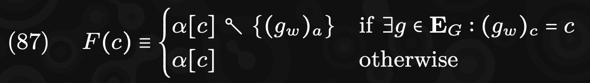

**GP release**
0.3.2

**Formula**
(formula text or image)

**Description**
Your description

**Depending Issues**

---

** Formula 12 **

**Description**

σ (Sigma) -> State of Blockchain.
B -> Block in question (1 at a time).
Υ (Upsilon) -> State transition Function. 
' Prime denotation -> A postiria

A postiria state is equal to the state transition function applied to our prior state and the current Block.

** Chapter 8 Formulas **

** Formula 85 **

**Description F85**

** Formula 86 **

**Description F86**

** Formula 87 **

**Description F87**